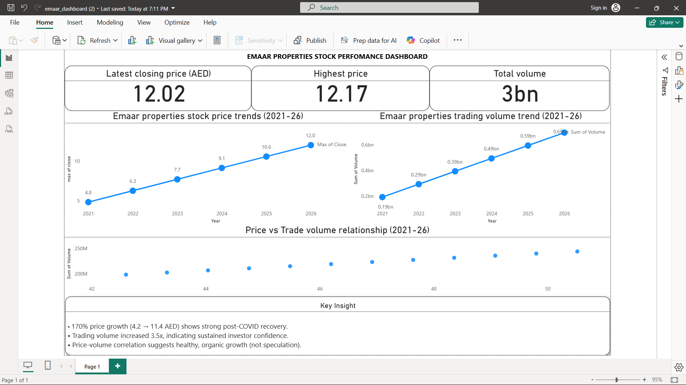

# EMAAR Properties – Stock Performance & Volume Analytics Dashboard

## Project Overview
This dashboard analyzes historical stock price trends and trading volume patterns of EMAAR Properties to evaluate post-pandemic recovery and investor sentiment.

## Key Business Insights
- 170% price growth during post-COVID market recovery
- 3.5x increase in trading volume indicating strong investor participation
- Clear positive correlation between price momentum and volume spikes
- Data-driven identification of bullish phases

## Tools Used
- Power BI
- Data Modeling
- Financial Trend Analysis
- Volume-Price Correlation Analytics

